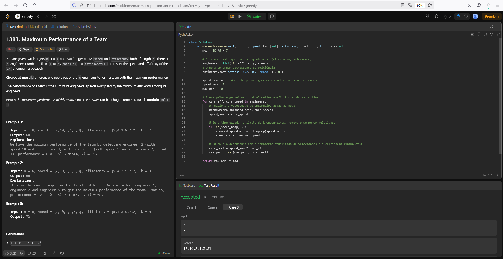

# 1383. maximum-performance-of-a-team

O arquivo [LC1383.py](./LC1383.py) apresenta a resolução do exercício número 1383 sobre greedy algorithms da plataforma LeetCode.

A resolução foi aceita pela plataforma, conforme a **Figura 1** abaixo:

**Figura 1** - Resolução da questão 1383.

## Explicação da solução

1. O algoritmo cria uma lista para unir unir as listas de eficiência e velocidade em uma só: engineers
2. Ordena a lista em ordem decrescente de eficiência
3. Cria um min-heap para guardar as velocidades selecionadas
4. Itera a lista engineers
   4.1. Adiciona a velocidade do engenheiro atual ao heap
   4.2. Se o time exceder o limite de k engenheiros, remove o de menor velocidade
   4.3. Calcula o desempenho com o somatório atualizado de velocidades e a eficiência mínima atual

**Saída:** Retorna o desempenho máximo do time.
