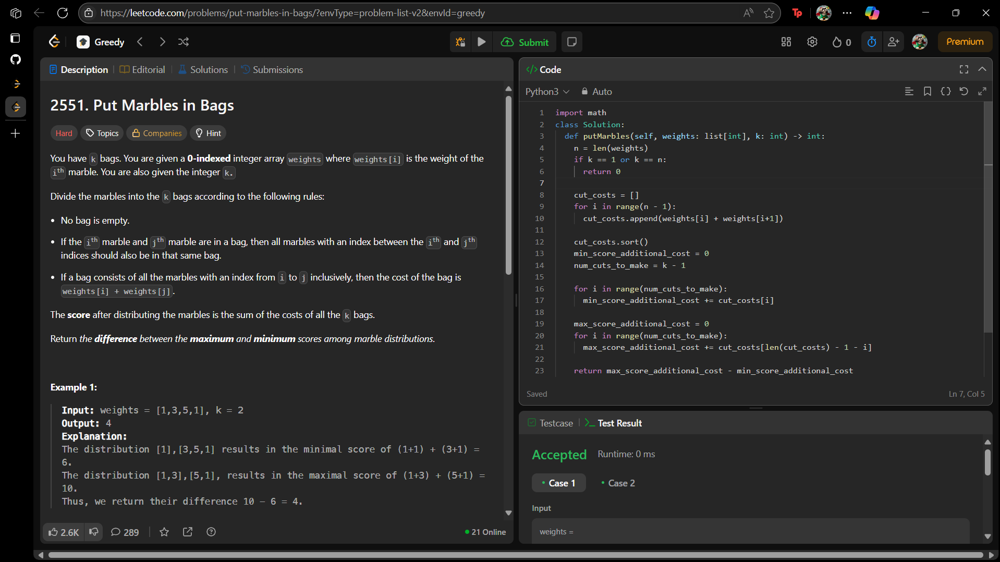

# 2551. Put Marbles in Bags

O arquivo [LC2551.py](./LC2551.py) apresenta a resolução do exercício número 2551 sobre greedy algorithms da plataforma LeetCode.

A resolução foi aceita pela plataforma, conforme a **Figura 1** abaixo:

**Figura 1** - Resolução da questão 2551.

## Explicação da solução

1. Calcular todos os n-1 custos de corte possíveis: cost_cut_i = weights[i] + weights[i+1].

2. Ordenar os custos de corte.

3. O score mínimo será weights[0] + weights[n-1] + (soma dos k-1 menores custos de corte) e o score máximo será weights[0] + weights[n-1] + (soma dos k-1 maiores custos de corte).

4. A diferença pedida é Score Máximo - Score Mínimo. Como weights[0] + weights[n-1] é comum, a diferença é: (Soma dos k-1 maiores custos de corte) - (Soma dos k-1 menores custos de corte).

5. Casos especiais:

    5.1. Se k=1, não há cortes (k-1 = 0). A soma dos custos de corte é 0. O score mínimo e máximo são ambos weights[0] + weights[n-1]. A diferença é 0.
    5.2. Se k = n, cada bolinha está em sua própria sacola. Todos os n-1 possíveis cortes são feitos. A soma dos menores custos de corte é igual à soma dos maiores custos de corte (ambas são a soma de todos os custos de corte). A diferença é 0.

**Saída:** A diferença entre o score máximo e mínimo possível.