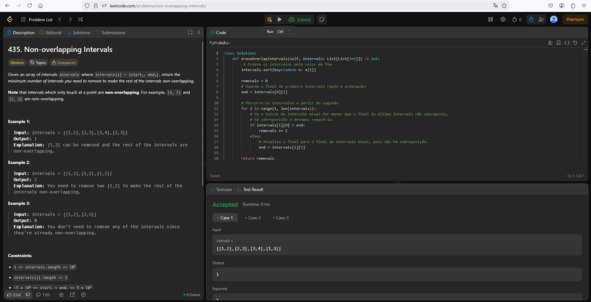

# 435. Non-overlapping Intervals

O arquivo [LC435.py](./LC435.py) apresenta a resolução do exercício número 435 sobre greedy algorithms da plataforma LeetCode.

A resolução foi aceita pela plataforma, conforme a **Figura 1** abaixo:

**Figura 1** - Resolução da questão 435.

## Explicação da solução

1. Ordena os intervalos pelo valor de fim.

2. Percorre os intervalos a partir do segundo intervalo.
  2.1. Se o intervalo atual é menor que o final do último intervalo, ele é removido.
    2.1.1 Soma um no valor dos intervalos removidos.
  2.2. Se não, a variável end é atualizada para o final do intervalo atual, pois não há sobreposição.

**Saída:** Retorna a quantidade de intervalos removidos.
